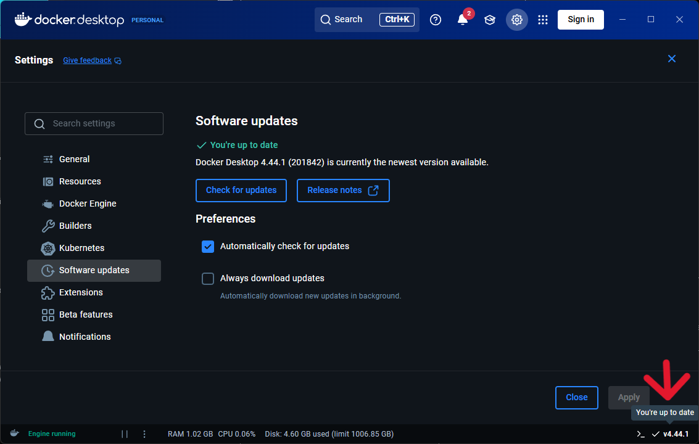
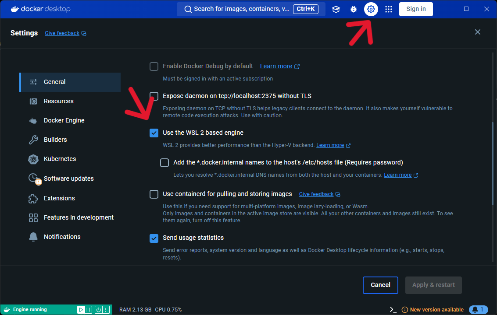
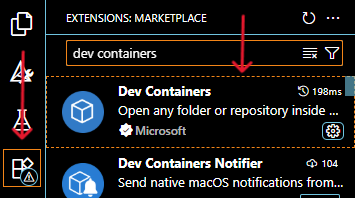
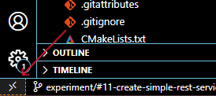
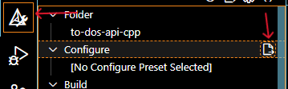
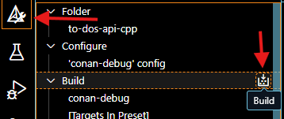
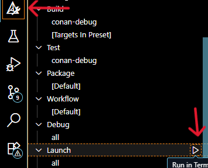

# to-dos-api-cpp

## How to build this project

It is recommended to build library and run tests using [Dev containers](https://code.visualstudio.com/docs/devcontainers/containers) in Visual Studio Code.
For development purposes use a devcontainer named `developing`.

### Prerequisites

- Install [WSL](https://ubuntu.com/desktop/wsl) 
- Install the Docker client ([Windows](https://docs.docker.com/desktop/setup/install/windows-install/) / [Mac](https://docs.docker.com/desktop/setup/install/mac-install/) / [Linux](https://docs.docker.com/desktop/setup/install/linux-install/)) 
  - Make sure Docker client is the latest version 
   <p style="text-align: center;"></p>
   - Make sure Docker uses WSL 2 based engine 
   <p style="text-align: center;"></p>
- Microsoft VS Code
  - VS Code should also have the "Dev Containers" extension installed. To check it, open "View: Extensions" with `Ctrl + Shift + X` or as shown in the screenshot below:
  <p style="text-align: center;"></p>
- Make sure Docker daemon is running before opening the dev container (`Ctrl + Shift + P` -> "Reopen in container" or click here + "Reopen in container")
 <p style="text-align: center;"></p>

### Project building

To build this project, open the VS Code terminal (`Ctrl + Shift + ~`) and run `conan install . --build=missing`.
After the Conan install process, open the CMake extension and click Configure. 
<p style="text-align: center;"></p>
In the configuration options, select the `'conan-debug' config`.

When the project configuration is finished, click Build to build the project.
<p style="text-align: center;"></p>

### Project run

#### Before launching web server:
- Run the database container via docker compose command `docker compose -f docker-compose.dev.yaml up -d` from workspace.

To launch the executable, click Launch in the CMake extension.
<p style="text-align: center;"></p>

## How to run clang-tidy static code analyzer

To run clang-tidy, run the following command:
```
find ./src -name "*.cpp" -not -path "*/build/*" -exec echo "Checking {}..." \; -exec clang-tidy --config-file=.clang-tidy {} -- -I./include -std=c++20 \;
```

## How to run an application build without tests

To skip the test file build process, you need to run the application build with the SKIPTESTS environment variable set to TRUE, this can be done by running the following command:
```
SKIPTESTS=TRUE conan build . --build=missing
```
## Working with ORM+Migration.

### ORM:

After creating the database or model, it is necessary to generate the auxiliary ODB files with the command `odb --std c++20 -d pgsql --generate-query -o odb-gen <model header file>` from the folder `src/data/models`.

After executing the command, files will be created or updated in the folder `src/data/models/odb-gen'. Please do not modify or transfer these files for the correct operation of the application.

### Migrations:

The alembic tool is used to work with migrations. To work with it, you need to modify or create a python model according to the cpp version of the model.

- Create/change python model according declared cpp model.
- Change terminal workspace to `src/data`.
- Use the alembic command `alembic revision --autogenerate -m '<name of migration>'` for create new migration to database.
- If its needed upgrade local database with latest migration with commnd `alembic upgrade head`.