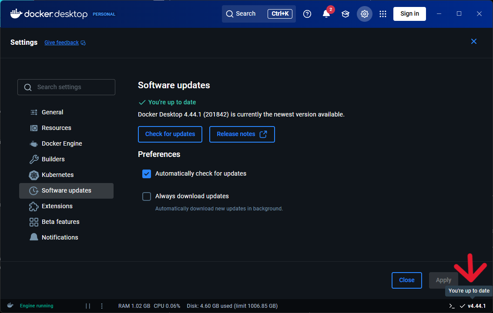
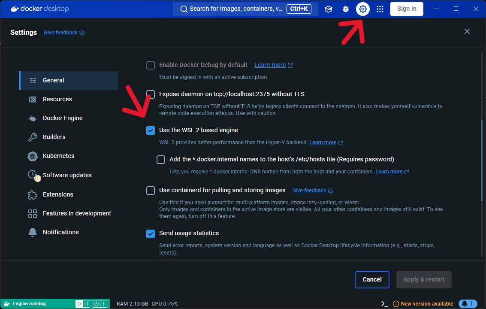
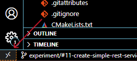
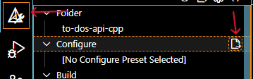
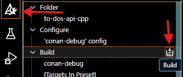
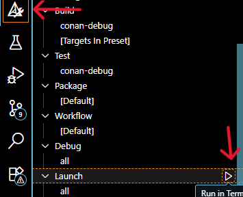
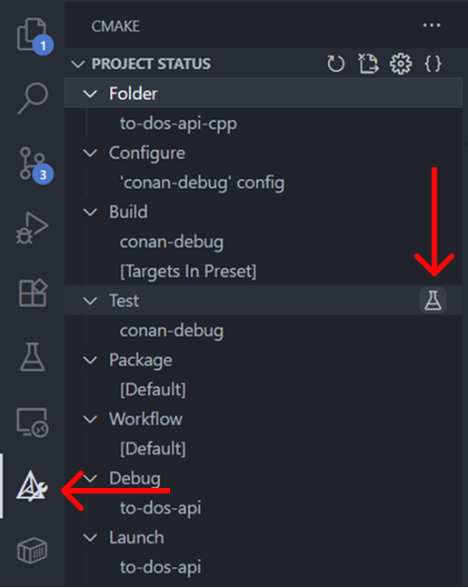

# to-dos-api-cpp

This repository contains a C++ API template based on the To-Dos example.

This repository and its infrastructure are specifically designed for development in the VSCode/GitHub Codespaces Dev Container environment based on Docker, which provides more reliable environment isolation as well as built-in cross-platform support.

More detailed information about To-Dos and related repositories can be found [here](https://github.com/TourmalineCore/to-dos-documentation).

## How to build this project

For a better development experience, we recommend building the library and running tests using the [Dev Containers](https://code.visualstudio.com/docs/devcontainers/containers) extension in VSCode.

### Prerequisites

- Install [WSL](https://ubuntu.com/desktop/wsl) 
- Install the Docker client ([Windows](https://docs.docker.com/desktop/setup/install/windows-install/) / [Mac](https://docs.docker.com/desktop/setup/install/mac-install/) / [Linux](https://docs.docker.com/desktop/setup/install/linux-install/)) 
  - Make sure Docker client is the latest version
    

      
Screenshot

      
    

  - Make sure Docker uses WSL 2 based engine
    

      
Screenshot

      
    

- Microsoft VSCode
  - VSCode should also have the [Dev Containers](https://code.visualstudio.com/docs/devcontainers/containers) extension installed. To check it, open "View: Extensions" with `Ctrl + Shift + X` or as shown in the screenshot below:
    

      
Screenshot

      
    

- Before running the container, create a `.env` file in the project root and specify the environment variables in it, just as you did in `.env.example`. Otherwise, running the devcontainer will result in an error.
- Make sure Docker daemon is running before opening the devcontainer (`Ctrl + Shift + P` -> "Reopen in container" or click here + "Reopen in container")
  

    
Screenshot

    
  

### Project building

Open the VSCode terminal (Ctrl + Shift + ~) and run:  
`conan install . --build=missing`  
`conan build .`  

The executable `to-dos-api` will be available in `build/Debug`.

#### CMake Tools

> Previously, dependencies must be installed and built using the command `conan install . --build=missing`.

Alternatively, you can use the [CMake Tools](https://marketplace.visualstudio.com/items?itemName=ms-vscode.cmake-tools) extension to build the project.

Open the CMake Tools extension and click `Configure`.

  
Screenshot

  

In the configuration options, select the `conan-debug` config.

When the project configuration is finished, click `Build` to build the project.

  
Screenshot

  

#### Build for ARMv8

To build for ARMv8, use the following commands instead:  
`conan install . -pr:h profiles/to-dos-conan-profile-arm64.conf --build=missing`  
`conan build . -pr:h profiles/to-dos-conan-profile-arm64.conf` 

#### Building the project without unit tests

By default, the build includes building unit tests. The executable `to-dos-api_unit_tests` will be available in `build/Debug/unit/`.

To build the project without unit tests, run the following commands:
`conan install . --build=missing`
`EXCLUDE_UNIT_TESTS_FROM_BUILD=true conan build .`

#### Building releases

To build the release version of the project, add the `--settings:host "build_type=Release"` option, for example, `conan build . --settings:host "build_type=Release"`.

Alternatively, you can duplicate the profile with the configuration you need and change the `build-type` property from `Debug` to `Release`. You can specify the needed profile using the `-pr:h` parameter, for example, `conan build . -pr:h profiles/to-dos-conan-profile-arm64.conf`.

After the build process is complete, the executable `to-dos-api` file will be located in `build/Release`.

### Project run

- If you're not working inside the VSCode Dev Container, import the environment variables specified in `.env` into your current terminal session using the following command: `export $(grep -v '^#' .env | xargs)`
- Run the database container via docker compose command `docker compose --profile DbOnly up -d`
- Apply the database migrations by going to the `alembic/` directory and running the command `alembic upgrade head`.

  Alternatively, you can use the `make apply-migrations` Make target.

- Run the executable (see the [Project building](#project-building) section) using the command `./build/Debug/to-dos-api`  

  Alternatively, you can use the `make run` Make target. In addition to running the project, the target will also initiate the installation and compilation of dependencies, as well as the compilation of the project, if any changes have been made.

If you're using the CMake Tools extension, you can run the executable by clicking `Launch` in the CMake Tools extension.

  
Screenshot

  

## Allocated Ports & Services

| Service Name | Api in Dev Container/Codespaces | Api in IDE | Api in Docker Compose |  Db in Docker Compose | Reserved for MockServer in Docker Compose | PgAdmin in Docker Compose |
| --- | --- | --- | --- | --- | --- | --- |
| to-dos-api-cpp | 4501 | 5501 | 6501 | 7501 | 8501 | 9501 |

Full docs about the allocated ports, reasoning, and the other services bindings in this infrastructre setup are available [here](https://github.com/TourmalineCore/inner-circle-documentation/blob/master/code-style/api-code-style.md#ports).

You can go to `Ports` tab in the `Terminal` parent panel to find available services.

The most useful is `PgAdmin` http://localhost:9501 (password is `postgres`).

## Linters

The project includes the `clang-tidy` code analyzer and the `clang-format` formatter. Configuration files are located in the project root in `.clang-tidy` and `.clang-format` files, respectively.

To use linters you need to install [C/C++ VSCode Extension](https://marketplace.visualstudio.com/items?itemName=ms-vscode.cpptools)

### clang-format

clang-format runs the format code automatically when the file is saved.

To format a file manually, run the command `clang-format -i <path>`. If you want to format all the files in the project, run the command `find ./src -name "*.cpp" -o -name "*.h" | xargs clang-format -i`.

### clang-tidy

clang-tidy runs the check automatically in the background.

To check a file manually, run the command `clang-tidy -p ./build/Debug <path>`. If you want to format all the files in the project, run the command `find ./src -name "*.cpp" -o -name "*.h" | xargs clang-tidy -p ./build/Debug`.

You can filter the clang-tidy output to show only errors by adding `grep "error:"`, for example, `clang-tidy -p ./build/Debug | grep "error:"`.

You can apply fixes for detected errors by adding the `--fix` flag, for example, `clang-tidy -p ./build/Debug --fix <path>`

Alternatively, to run a full project check with `clang-tidy`, you can use the `make run-code-analysis` Make target.

## Run tests

The project implements unit and e2e tests using the features of the [GTest](https://github.com/google/googletest) and [Karate](https://github.com/karatelabs/karate) libraries, respectively. Unit tests are located in the `unit/` directory, and e2e tests in the `e2e/` directory.

For unit tests, the `unit/` directory contains a `CMakeLists.txt` file that builds a separate executable file, `to-dos-api_unit_tests`, for testing.

For e2e tests, the `e2e/` directory contains `KarateDockerfile`, which builds an image containing the necessary environment for running Karate tests and the `karate.jar` executable itself.

### How to run unit tests

To run the unit tests, you must first build the executable file `to-dos-api_unit_tests` (see the [Project building](#project-building) section). After building, the executable file will be located in the `build/Debug/unit/` directory.

To run the tests, use the `ctest --test-dir build/Debug/unit/` command.

Alternatively, use the CMake Tools extension in VSCode. To do this, open the CMake Tools extension and click `Test`, after configuring and building the project.

  
Screenshot

  

### How to run e2e tests

You can run e2e tests using Docker Compose and [GitHub Actions](https://github.com/TourmalineCore/to-dos-api-cpp/actions).

To run e2e tests using Docker Compose, use the command `docker compose --profile MockForPullRequest up --exit-code-from to-dos-api-cpp-karate-tests`.

e2e tests are run automatically in GitHub Actions with every commit to the repository.

## Working with ORM+Migration.

### ORM:

After creating the database or model, it is necessary to generate the auxiliary ODB files. 
For generating these files use script `./scripts/generate_odb_files.sh`

After executing the script, files will be created or updated in the folder `src/data/models/odb-gen'. Please do not modify or transfer these files for the correct operation of the application.

### Migrations:

The alembic tool is used to work with migrations. To work with it, you need to modify or create a python model according to the cpp version of the model.

- Create/change python model according declared cpp model.
- Change terminal workspace to `src/data`.
- Use the alembic command `alembic revision --autogenerate -m '<name of migration>'` for create new migration to database.
- If its needed upgrade local database with latest migration with commnd `alembic upgrade head`.

Alternatively, you can use make targets.
- To create a migration, run the command `make create-migration name=<name-of-migration>`, where `name` is the name of the migration. You can also use `make create-migration`, in which case the migration will be named after the current date and time.
- To apply the migrations, run the `make apply-migrations` command.