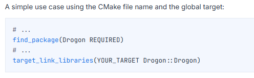

# Взять и использовать или как мы упростили себе жизнь при разработке на C++

Представьте, что вы решили начать разработку нового API C++ бекенда и вместо того, чтобы создавать новый репозиторий, искать подходящие инструменты и настраивать всю инфраструктуру с нуля, нажимаете пару кнопок и шаблон для вашего будущего API с настроенной инфраструктурой уже готов.

Представили? Мы тоже и ограничиваться одним только представлением не стали, поэтому всерьез задумались о воплощении такого шаблона в жизнь. К тому же, разработку вели в формате open-source, поэтому каждый из вас может просто [взять](https://github.com/TourmalineCore/to-dos-api-cpp) и [использовать](https://github.com/TourmalineCore/to-dos-api-cpp/blob/master/README.md) его для своих целей.

С его помощью вы получаете готовую инфраструктуру API C++ бекенда: настроенную систему сборки под разные конфигурации, менеджер пакетов, библиотеку тестирования, пайплайн и миграции - остается лишь склонировать и попробовать, вдруг это подойдет и для вас.

Но до этого давайте разберемся, как появилась идея создания подобного шаблона. Ранее мы уже занимались разработкой чего-то подобного и в закромах своего GitHub имеем несколько шаблонов, на [.NET](https://github.com/TourmalineCore/to-dos-api-dot-net) и [NestJS](https://github.com/TourmalineCore/to-dos-api), которые реализуют приложение для управления задачами - To-Dos. Кстати, шаблон на [NestJS](https://github.com/TourmalineCore/to-dos-api) использовался в качестве примера в [воркшопе](https://techtrain.ru/talks/20004151/) на тему TDD разработки на фронтенде от нашего руководителя Александра.

Мы решили реализовать что-то похожее, но используя C++, чтобы, при неободимости, быстро стартовать проект, подобно create-react-app, когда одной команды в терминале достаточно, чтобы перед тобой появилась готовая структура проекта со всем необходимым.

Наверное, каждый разработчик перед тем, как начать писать API backend на C++, задаётся вопросом - не делает ли он ошибку, выбирая такой язык, как C++, для реализации? Не будет ли правильнее взять что-то более современное и устоявшееся, как например C# (.NET), JavaScript/TypeScript (NestJS) или Python (FastAPI)? И если говорить начистоту, то в большинстве случаев сменить язык будет правильным выбором, но, несмотря на это, С++ имеет свои сильные стороны. 

Так, благодаря своей специфике, C++ предоставляет разработчику полный контроль над ресурсами и производительностью приложения, что открывает возможности для создания высоконагруженных API, где важны скорость и эффективность работы. Но не стоит забывать, что при этом приходится жертвовать скоростью разработки, поскольку сложность и вероятность совершить ошибку становятся существенно выше.

Поэтому, если цель - это простой API с несложными выборками из базы данных, то C++, скорее всего, не ваш вариант. В этом случае можно присмотреться к готовым шаблонам, которые мы упоминали ранее. Но если речь о проекте со сложной архитектурой, множеством интеграций и высокими требованиями к производительности, где важна тонкая настройка под конкретные сценарии, - это именно то, для чего C++ подходит лучше всего.

В отличие от большинства технологий для задач бекенда, плюсом в пользу C++ можно считать результат компиляции. На выходе вы получаете самостоятельный бинарник, а не приложение, которому для запуска нужен установленный рантайм (вроде .NET runtime или Node.js) и набор зависимостей вокруг него. Благодаря этому не нужно следить, установлена на сервере нужная версия рантайма или нет, что уменьшает окно потенциальных ошибок и неопределенного поведения. Бинарник требует минимальное количество настройки, а иногда вовсе не требует.

Дальше расскажем, как шаблон устроен и почему он выглядит именно так, а также через какие подводные камни нам пришлось пройти, чтобы каждый, кто его возьмет, мог уверенно стартовать свой проект, не уделяя время настройке необходимой инфраструктуры и не наступая на те же грабли.

## Выбор инструментов

Возникает вопрос выбора инструментов, которые будут использоваться для реализации, а здесь всё начинается с поиска и изучения того, что предлагает экосистема. 

Прежде всего мы решили посмотреть, что уже есть на эту тему - статьи, доклады, возможно, готовые проекты, которые могли бы упростить выбор и заранее подсветить подводные камни. Но довольно быстро стало понятно, что материалов на поверхности крайне мало. Статей и докладов о разработке бекенда на C++ оказалось меньше, чем мы рассчитывали, а open-source шаблоны подобного рода и вовсе редкость.

Это, впрочем, не выглядело поводом для расстройства, а скорее стало дополнительным аргументом в пользу того, что тема слабо освещена, и наш шаблон, а также опыт его разработки могли оказаться действительно полезны, тем более что мы изначально планировали делать проект открытым и делиться этим опытом с другими. И опыт этот, прежде всего, об одной идее: нам, как разработчикам, хочется, чтобы работа была устроена легко и просто - это именно то, к чему мы стремились с самого начала. 

### Система сборки

Но озвученная идея разбивается о реальность, как только речь заходит о сборке проекта, а в C++ это важная часть любого проекта. В отличие от JavaScript, Python и многих других языков, в комьюнити C/C++ так и не сложилось единого подхода, но из большинства [CMake](https://cmake.org/) стал ближе всего к негласному стандарту, поскольку он кроссплатформенный, поддерживается практически всеми IDE и компиляторами, а большинство современных библиотек уже поставляются с готовой CMake-конфигурацией. Выбор здесь напрашивался сам собой.

### Пакетный менеджер

С пакетным менеджером история повторилась. В первую очередь мы выбирали между [vcpkg](https://vcpkg.io/en/) и [Conan](https://conan.io/). Остановились на [Conan](https://conan.io/), поскольку он, в отличие от [vcpkg](https://vcpkg.io/en/), не ограничен связкой [CMake](https://cmake.org/) и [MSBuild](https://learn.microsoft.com/ru-ru/visualstudio/msbuild/walkthrough-using-msbuild?view=visualstudio), а одинаково хорошо работает с разными системами сборки и позволяет точно описывать окружение (компилятор, архитектуру, ОС, тип сборки и т.п.) через профили. Эта гибкость является для нас важным аспектом, ведь шаблон должен был одинаково собираться под разные архитектуры и операционные системы, а не быть заточен под одну конкретную конфигурацию.

### Компилятор

С компилятором повторилась похожая логика. [MSVC (Microsoft Visual C++)](https://visualstudio.microsoft.com/ru/vs/features/cplusplus/) отпал почти сразу, поскольку, как и в случае с [vcpkg](https://vcpkg.io/en/), не хотелось привязываться к конкретной платформе или IDE, а MSVC по сути жёстко связан с экосистемой Windows и Visual Studio.

В выборе между [GCC](https://gcc.gnu.org/) и [Clang](https://clang.llvm.org/) решающую роль сыграла экосистема. [Clang](https://clang.llvm.org/) поставляется в составе LLVM, который включает в себя и другие полезные инструменты, такие как [clang-tidy](https://clang.llvm.org/extra/clang-tidy/) и [clang-format](https://clang.llvm.org/docs/ClangFormat.html) для статического анализа и форматирования кода, которые развиваются параллельно компилятору [Clang](https://clang.llvm.org/) и благодаря этому имеют хорошую совместимость, поэтому мы решили использовать его.

### Веб-фреймворк

В выборе веб-фреймворка мы остановились на [Drogon](https://drogon.org/), поскольку, как нам показалось, у него низкий порог входа и понятный синтаксис. Из минусов можем отметить документацию, поскольку некоторые разделы содержат битые ссылки, что порой усложняет восприятие и попытки найти нужный материал.

Помимо [Drogon](https://drogon.org/), рассматривали [Oat++](https://oatpp.io/) и  [userver](https://userver.tech/). [Oat++](https://oatpp.io/) показался нам более сложным и многословным по сравнению с [Drogon](https://drogon.org/). С [userver](https://userver.tech/) ситуация другая, фреймворк отсутствует в `conan-center-index` (хранилище пакетов [Conan](https://conan.io/)), а его установка подразумевает самостоятельную сборку из репозитория разработчиков по их собственному шаблону, что не подходит нам.

### ORM

В качестве ORM системы изначально мы рассматривали те, что встроены в фреймворки [Drogon](https://drogon.org/) и [Oat++](https://oatpp.io/), но впоследствии отказались от этой идеи, поскольку они ориентированы на работу в формате SQL first, а не следуя паттерну Data Mapper, как нам хотелось. Кроме того, [Drogon](https://drogon.org/) подразумевает, что база данных создаётся и наполняется таблицами вручную через SQL, и только после этого утилита drogon_ctl генерирует C++ классы моделей по уже существующей схеме, подключившись к базе.

Также в определённый момент рассматривали использование [TinyORM](https://www.tinyorm.org/), но быстро отказались от этой идеи: как нам показалось, проект перестал поддерживаться, ведь последний коммит в репозитории был почти 2 года назад.

В итоге мы остановились на ODB, поскольку, на наш взгляд, это более продвинутый инструмент, который позволяет работать с базой данных с помощью объектов и их методов, а не через SQL напрямую. 

Стоит отдельно упомянуть про лицензию. ODB распространяется под GPLv2, что подразумевает открытый исходный код. В случаях, когда проект имеет лицензию более свободную, чем GPL (например, Apache или MIT), есть возможность по запросу получить персональную и более свободную версию лицензии. Code Synthesis, разработчик ODB, также предлагает бесплатную проприетарную лицензию (FPL) для небольших проектов, её можно получить, если объём сгенерированного кода поддержки базы данных в рамках одного релиза приложения не превышает 10 000 строк (~10-20 классов моделей). Для более крупных закрытых проектов потребуется приобрести коммерческую проприетарную лицензию (CPL).

### Миграции

В момент реализации механизма применения миграций к базе данных мы еще не были знакомы с возможностями ODB в этой области. Как оказалось, с версии 2.3.0 ODB добавил поддержку ревизий схемы базы данных, включая генерацию миграций на основе изменений в моделях. Тогда же мы решили использовать отдельный инструмент - [Alembic](https://alembic.sqlalchemy.org/en/latest/). Кроме того, мы увидели возможность показать в шаблоне пример того, как C++ API может взаимодействовать с инструментами из другого окружения, в нашем случае Python.

Alembic показался нам хорошим выбором, поскольку реализовать логику применения миграций и описать модели с его помощью оказалось довольно просто, но пришлось завести отдельное представление модели на Python, которое повторяло структуру моделей ODB.

## Внутреннее устройство шаблона

Как всё это выглядит на практике? Начнём с общей структуры, а дальше подробнее остановимся на отдельных её частях.

### Структура проекта

```ini
.devcontainer/          # Конфигурация VSCode DevContainer
.github/                # Конфигурация пайплайна GitHub Actions
.vscode/                # Настройки редактора и сниппеты кода для VSCode
alembic/                # Конфигурация Alembic и список миграций
ci/                     # Конфигурация для запуска API в кластере k8s
deps/                   # Собственные Conan-рецепты зависимостей
docs/                   # Документация проекта
profiles/               # Conan-профили под отдельные конфигурации сборки
scripts/                # Вспомогательные скрипты
src/                    # Код приложения
unit/                   # Unit тесты
e2e/                    # E2E тесты
test_package/           # Служебный conanfile для проверки собранного Conan-пакета
.clang-format           # Конфигурация автоформатирования кода
.clang-tidy             # Конфигурация статического анализа кода
.env.example            # Пример файла переменных окружения
.gitattributes          # Настройки Git
.gitignore              # Список файлов и директорий, игнорируемых Git
CMakeLists.txt          # Корневой конфигурационный файл сборки
CMakeUserPresets.json   # Пресеты CMake, генерируемые Conan
conanfile.py            # Рецепт Conan-пакета приложения
docker-compose.yml      # Конфигурация для запуска базы данных и других сервисов
Dockerfile              # Многоступенчатая сборка продуктового образа
LICENSE                 # Лицензия проекта
Makefile                # Таргеты Makefile для быстрых команд
README.md               # Основная информация о проекте, инструкции
```

### Dev Container

Директория `.devcontainer` содержит конфигурацию для разработки внутри Dev Container в VS Code. Сборка самого контейнера идёт на основе `Dockerfile`, который лежит в той же директории и устанавливает весь набор инструментов, таких как [Clang](https://clang.llvm.org/), CMake, [Conan](https://conan.io/) и остальные. Там же, в `Dockerfile` производится копирование в `/root/.conan2/profiles/default` лежащего рядом Conan-профиля `to-dos-conan-profile.conf`, тем самым содержимое профиля устанавливается в значение по умолчанию, в результате [Conan](https://conan.io/) подхватывает его автоматически при любой сборке, без необходимости указывать профиль вручную через флаг.

Чтобы не собирать зависимости и проект с нуля при каждом пересоздании контейнера, в `devcontainer.json` настроено кэширование через именованные Docker volumes. Отдельно кэшируется директория `.conan2` со скачанными и собранными [Conan](https://conan.io/)-пакетами и директория сборки `build`, где хранятся сгенерированные [Conan](https://conan.io/) файлы toolchain'а для [CMake](https://cmake.org/). Без этого кэширования пересборка контейнера с нуля означала и пересборку всех зависимостей заново, а это существенно увеличивает время сборки (в нашем случае более 20 минут).

В том же `devcontainer.json` через хук `postCreateCommand` сразу после создания контейнера автоматически подключается локальное хранилище рецептов [Conan](https://conan.io/), чтобы не приходилось выполнять эту команду вручную.

Дополнительно мы использовали [Dev Container Feature](https://containers.dev/features) - `docker-outside-of-docker`, которая позволяет работать с Docker на хост-машине изнутри devcontainer, а не поднимать вложенный Docker внутри контейнера. Кроме того, её использование позволяет наблюдать запущенные контейнеры через Docker Desktop, что достаточно удобно. 

Чтобы контейнеры, поднятые на хосте, были доступны и по сети из самого devcontainer, в `runArgs` явно указан флаг `--network=host`, который подключает devcontainer к сети хост-машины напрямую, а не изолирует его в собственной Docker-сети.

### Пакетные рецепты

По умолчанию, устанавливая зависимость, [Conan](https://conan.io/) ищет её рецепт в собственном публичном индексе, который называется `conan-center-index`. Бывает так, что это хранилище не содержит нужного пакета, поэтому в [Conan](https://conan.io/) предусмотрена возможность подключения собственных источников рецептов, в дополнение к официальному индексу.

Чтобы [Conan](https://conan.io/) смог увидеть локальные рецепты, директория, в которой находятся рецепты (в нашем случае `deps`), подключается как дополнительный локальный remote командой `conan remote add local-recipes ./deps --type=local-recipes-index`. После этого при установке зависимостей [Conan](https://conan.io/) берёт рецепты уже не из публичного индекса, а из локальной папки, собирает исходники под нужную конфигурацию и кладёт готовые бинарники в кэш, то есть точно так же, как если бы эти пакеты были частью `conan-center-index`.

### Тесты

В проекте реализовано два вида тестов: unit и E2E.

Unit-тесты используют библиотеку [GTest](https://google.github.io/googletest/) и вынесены в отдельную директорию `unit` со своим `CMakeLists.txt`, в котором описана вся логика сборки тестового бинарника, он собирается как отдельный исполняемый файл, независимый от основного. Сборка тестов подключается в корневом `CMakeLists.txt` и может быть отключена переменной окружения `EXCLUDE_UNIT_TESTS_FROM_BUILD`, установленной в значение `true`. Также, сборка тестов не происходит при кросс-платформенной сборке, поскольку в этом случае не получится запустить сам исполняемый файл тестов на машине, где происходила сборка. 

> На данный момент в директории лежит только один unit-тест, который служит примером возможного теста.

E2E-тесты реализованны с использованием библиотеки [Karate](https://docs.karatelabs.io/) и вынесены в отдельную директорию `e2e`. В случае E2E, вместо изолированного бинарника с тестами Karate выполняет HTTP-запросы к уже поднятому и работающему экземпляру API. Сценарий (тест) лежит в директории `e2e`, в файле `to-dos-happy-path.feature`, и последовательно проходит через все эндпоинты приложения, начиная от создания задачи, и заканчивая удалением и финальной проверкой, что задачи больше нет в базе.

Поскольку Karate запускается не как часть сборки приложения, а как самостоятельный процесс, для него в той же директории `e2e` заведён отдельный `KarateDockerfile`, который использует за основу лёгкий образ с Java и скачанным `karate.jar`, не связанный с основным `Dockerfile` приложения. Такое разделение позволяет запускать e2e-тесты в двух разных окружениях: в docker-compose и в кластере [k8s](https://kubernetes.io/), где собранный образ приложения разворачивается через Helm.

### CI-пайплайн

Пайплайн состоит из двух воркфлоу, расположенных в директории `.github/workflows`.

Первый воркфлоу, `.reusable-docker-build-and-push.yml`, отвечает за сборку и публикацию Docker-образа. Он выполняется в двух случаях: при пуше в master-ветку, тогда собирается и публикуется актуальный образ с тегом `latest`, либо по вызову из другого воркфлоу. Сама сборка происходит для двух архитектур, arm64 и amd64, затем оба образа объединяются в единый мультиархитектурный образ с помощью `docker buildx`.

Второй воркфлоу, `e2e-tests-on-pull-request.yml`, запускается на каждый pull request и выполняет E2E-тесты. Выполнение тестов происходит в двух джобах, каждая из которых отвечает за собственное окружение. Первая джоба вызывает воркфлоу сборки образа API, дожидается публикации образа под конкретным коммитом и разворачивает его через [Helm](https://helm.sh/ru/) в тестовый кластер [k8s](https://kubernetes.io/), поднятый прямо в CI. Вторая джоба поднимает `docker-compose`, который собирает актуальный образ приложения и запускает его вместе с базой данных и контейнером Karate в общей Docker-сети.

### Alembic и миграции

Вся логика, связанная с миграциями, вынесена в отдельную директорию `alembic` в корне проекта, это было сделано осознанно, чтобы не смешивать ее с кодом самого приложения, то есть в стороне от `src`.

Внутри лежит основной конфигурационный файл [Alembic](https://alembic.sqlalchemy.org/en/latest/) - `alembic.ini`, который в целом остался близким к стандартному, сгенерированному самим [Alembic](https://alembic.sqlalchemy.org/en/latest/) при инициализации. Внутри этого файла можно найти параметр `script_location`, который содержит путь к директории `migrations`, где [Alembic](https://alembic.sqlalchemy.org/en/latest/) будет искать сценарий окружения и сами файлы миграций.

Внутри директории `migrations` находится `env.py`, который предназначен для настройки окружения при каждом запуске, также здесь происходит чтение переменных среды (`POSTGRES_HOST`, `POSTGRES_PORT` и так далее), содержащих данные необходимые для подключения к базе данных, само подключение, и, если базы ещё не существует, логика автоматического создания базы перед применением миграций. Там же лежит папка `versions` с самими миграциями (на данный момент там всего одна, начальная, создающая таблицу `todo`).

Отдельно существует директория `models` с файлом `to_do.py`, который представляет собой Python-класс, основанный на SQLAlchemy и повторяющий структуру ODB-модели `ToDo` из C++ представления модели. Именно его `env.py` использует как `target_metadata`, когда при вызове `alembic revision --autogenerate` производит сравнение метаданных с текущим состоянием базы данных, на основе разницы которых [Alembic](https://alembic.sqlalchemy.org/en/latest/) генерирует новую миграцию.

### Код приложения

Весь код приложения находится в директории `src`. 

Если говорить об архитектуре, то мы выбрали для себя 3-х уровневую архитектуру, которая состоит из:
- `src/api` - Уровень представления
- `src/application` - Уровень бизнес-логики
- `src/core` - Уровень данных

Такой подход:
- Помогает эффективно работать с обширным набором кода, поскольку разработчик понимает, где он должен искать ту или иную логику
- Разделяет приложение на отдельные части, каждая из которых выполняет свои функции, что позволяет вести разработку каждой из частей отдельно от других
- Ограничивает распространение изменений в коде, препятствуя возникновению ошибок, упрощая тестирование и поддержку кода

Каждый из слоев собирается как отдельная статическая библиотека и линкуется в единый исполняемый файл в корневом `CMakeLists.txt`. Такая изоляция позволяет предотвратить построение взаимосвязей между слоями на уровне компиляции, поскольку обратиться к функционалу из другого слоя становится затруднительно.

#### Уровень представления

Представляет собой логический уровень взаимодействия API с пользователем. Этот слой не содержит бизнес-логики и не взаимодействует с уровнем данных напрямую, а только лишь через уровень бизнес-логики. Включает в себя контроллеры, выполняя функцию обработчика HTTP-запросов.

#### Уровень бизнес-логики

Представляет собой логический уровень выполнения бизнес-логики приложения. Код внутри сгруппирован по функционалу, где каждая директория в `application/features` описывает один конкретный сценарий использования (создание задачи, удаление и т.п.).

Каждый такой сценарий имеет классы с чётко разделённой ответственностью. Command или Query отвечает непосредственно за обращение к базе данных, а Handler принимает Request, вызывает нужный Command или Query и формирует из результата Response.

Также в `application` находится `db_connection`, представляющий собой обертку для получения общего подключения к базе данных, которое в последствии передаётся во все Command и Query классы, `shared-dtos` являются DTO, используемые сразу в нескольких сценариях, и `odb-gen`, который содержит сгенерированный ODB-компилятором код, обеспечивающий саму работу с базой на основе моделей, описанных в уровне данных.

#### Уровень данных

Представляет собой логический уровень, описывающий структуру данных приложения. Здесь находится класс, описывающий сущность `ToDo`, размеченную ODB-прагмами, которые определяют, как объект существует таблице в базы данных (поля, их типы и т.п.). На основе этих классов моделей ODB-компилятор генерирует код для уровня бизнес-логики.

### Docker Compose

В проекте есть `docker-compose.yml`, который описывает конфигурацию для запуска 4-х сервисов. Все они объединены в одну общую сеть, что позволяет сервисам обращаться друг к другу по имени.

Сервис `to-dos-api-cpp-db` - это локальный PostgreSQL, который используется приложением в качестве базы данных. Для контейнера определен healthcheck, на статус которого ориентируются остальные сервисы, зависящие от базы.

Сервис `to-dos-api-cpp-pgadmin` добавляет встроенное решение для просмотра базы данных. При старте pgAdmin автоматически подключается к базе данных, используя смонтированный файл `servers.json`, в котором заранее прописаны параметры подключения.

Сервис `to-dos-api-cpp` использует в качестве основы тот же `Dockerfile`, что применяется и для сборки продуктового образа приложения, но с флагом `EXCLUDE_UNIT_TESTS_FROM_BUILD=true`, который исключает unit-тесты из сборки. У сервиса также переопределена точка входа, перед запуском самого приложения сначала применяются миграции через [Alembic](https://alembic.sqlalchemy.org/en/latest/), и лишь после этого запускается API. Этот контейнер выступает целью для обращений сервиса `to-dos-api-cpp-karate-tests`.

Сервис `to-dos-api-cpp-karate-tests` собирается на основе образа с JRE, необходимого для запуска библиотеки тестирования Karate, которая распространяется в виде обычного `.jar`-файла. Сам `karate.jar` скачивается при сборке образа. После старта контейнера запускается выполнение e2e-сценария `to-dos-happy-path.feature`, который делает запросы к контейнеру `to-dos-api-cpp` и завершает работу с кодом, соответствующим результату выполнения тестов.

В конфигурации предусмотрено два профиля, позволяющих поднимать разный набор сервисов в зависимости от задачи:
- `DbOnly` - используется при локальной разработке и запускает только `to-dos-api-cpp-db` и `to-dos-api-cpp-pgadmin`;
- `MockForPullRequest` - используется для запуска e2e-тестов в среде docker compose в CI-пайплайне, в воркфлоу `e2e-tests-on-pull-request.yml`.

Если вы ещё не знакомы с концепцией Docker профилей, то рекомендуем ознакомиться с другой нашей [статьей](https://tourmalinecore.com/articles/docker-compose-profiles-templates), где мы рассмотрели и использовали профили во время формирования конфигурационного файла Docker Compose для другого проекта.

### Makefile

С целью улучшения опыта разработки, мы добавили в шаблон Makefile. 

Makefile группирует в себе наборы команд, необходимых для выполнения различных сценариев, таких как применение миграций или запуск приложения. Такие сценарии именуются targets и могут быть вызваны как локально, так и из CI-пайплайна. Также, чаще всего утилита make, которая исполняет правила, описанные в Makefile, уже предустановлена в UNIX-подобные системы.

Наш Makefile выгдялит следующим образом:
```makefile
# Импорт переменных среды из .env для того, чтобы переменные 
# были доступны во время выполнения инструкций
include .env
export

# Создание новой миграции
create-migration:
	@cd ./alembic && \
	alembic revision --autogenerate -m $(name)

# Применение всех существующих миграций
apply-migrations:
	@cd ./alembic && \
	alembic upgrade head

# Запуск проекта с предварительным применением миграций и сборкой
run: apply-migrations
	@conan build . --build=missig && \
	./build/Debug/to-dos-api

# Запуск анализатора кода
run-tidy:
	@run-clang-tidy -p build/Debug
```

### Профили и скрипты

Хочется обратить внимание на некоторые тонкости, которые были внутри шаблона.

#### [Conan](https://conan.io/) профиль

Conan в процессе собственной конфигурации вводит понятие [профиля](https://docs.conan.io/2/reference/config_files/profiles.html), который представляет собой свод параметров и инструкций, определяющих характеристики систем, на которых будет происходить сборка и запуск приложения, параметры компиляции и другое.

В документации [Conan](https://conan.io/) почти в каждом этапе сборки проекта предварительно рекомендуется выполнить команду `conan profile detect`, которая определит профиль по умолчанию на основе характиристик системы, на которой происходит запуск. Поскольку для нас важна воспроизводимость сборки, мы решили зафиксировать конфигурацию, определив собственный профиль, который выглядит следующим образом:
```ini
[settings]
# Автоматическое определение системы, с использованием detect_api (например, Linux, Windows или MacOS)
os={{detect_api.detect_os()}} 
# Автоматическое определение архитектуры, с использованием detect_api (например, x86_64 или armv8)
arch={{detect_api.detect_arch()}}
# Тип сборки
build_type=Debug
# Компилятор
compiler=clang
# Версия компилятора
compiler.version=14
# Реализация стандартной библиотеки C++
compiler.libcxx=libstdc++11
# Стандарт C++
compiler.cppstd=gnu20

[conf]
# Явно указывает, какие исполняемые файлы использовать для C и C++ компиляции
tools.build:compiler_executables={"c":"clang","cpp":"clang++"}
# Задаёт количество параллельных job равное числу доступных ядер процессора
tools.build:jobs={{os.cpu_count()}}
# Разрешает системному пакетному менеджеру (apt, brew и т.д.) автоматически устанавливать недостающие системные зависимости
tools.system.package_manager:mode=install
```

Таким образом мы зафисировали для себя нужные параметры, такие как компилятор и его версию, версию стандартной библиотеки и т.п., но при этом сохранили гибкость при работе на разных системах и архитектурах. Кроме того, в дальнейшем мы смогли переиспользовать этот профиль в GitHub Actions.

Также, чтобы избежать необходимости постоянно указывать нужный профиль [Conan](https://conan.io/), мы переопределили тот, что используется по умолчанию, на наш, скопировав содержимое в `~/.conan2/profiles/default`.

#### Скрипт генерации кода поддержки базы данных

Для того, чтобы ODB, которая используется в качестве ORM, могла осуществлять работу с базой данных, предварительно необходимо сгенерировать код поддержки этой самой базы данных на основе описанных моделей. Так как процесс генерации требует наличия установленного компилятора odb и необходимость в генерации возникает не так часто, только при создании или изменении существующих моделей, было принято решение вынести эту логику в отдельный скрипт.

Скрипт расположен в `./scripts/generate_odb_files.sh` и выполняет несколько этапов, которые включают в себя: установку компилятора, парсинг описанных моделей, генерацию кода и последующее удаление компилятора.

## Подводные камни

Далее мы рассмотрим "подводные" камни, которые встретились нам во время разработки и как мы решили их.

### Первый камень

Пожалуй, одной из самых насущных проблем оказалось отсутствие необходимых пакетов в `conan-center-index`. Как мы упоминале ранее, в выборе ORM мы остановились на ODB, но, к сожалению, нужных нам зависимостей `libodb` и `libodb-pgsql` не оказалось в `conan-center-index`. 

Конечно, оставался вариант найти и положить готовый бинарный файл внутрь проекта, но таким образом запустить шаблон на любой системе не вышло бы, поскольку для разных конфигураций необходимы разные бинарные файлы, что требует дополнительной ручной подгонки, которой нам хотелось избежать.

Тогда появилась идея создать собственный [Conan](https://conan.io/) рецепт для требуемых зависимостей. Мы подготовили рецепты и отправили их в виде PR с прикрепленным issue в `conan-center-index`, а пока что положили их локально в директорию `./deps/conan-tourmalinecore-index/recipes`, которая представляет собой подмодуль.

Будем рады, если вы поддержите своим лайком соответствующие PR: [libodb](https://github.com/conan-io/conan-center-index/pull/30476) и [libodb-pgsql](https://github.com/conan-io/conan-center-index/pull/30477), тем самым приблизив публикацию рецептов в `conan-center-index`.

### Второй камень

Следующее, с чем мы столкнулись - это миграции базы данных. Как упоминали ранее, мы остановились на [Alembic](https://alembic.sqlalchemy.org/en/latest/), который является официальным инструментом для библиотеки SQLAlchemy и предназначен для управления версиями схемы базы данных и применения миграций.

Таким образом, порядок действий является следующим:
- Установка Python и пакетов alembic, psycopg2-binary и sqlalchemy-utils
- Инициализация Alembic командой `alembic init migrations`
- Описание моделей, подобно тем, что описаны на C++ с использованием прагм ODB, но уже на Python
- Запуск генерации миграции командой `alembic revision --autogenerate -m "new migration"`
- Применение миграции в базу данных `alembic upgrade head`

### Третий камень

С самого начала у нас было желание организовать все так, чтобы свести работу с [CMake](https://cmake.org/) к минимуму. В определенный момент нам даже показалось, что [Conan](https://conan.io/) помимо функций пакетного менеджера может выполнять роль системы сборки, но в последствии мы поняли, что это заблуждение и то, что [Conan](https://conan.io/) - это ни что другое, кроме как пакетный менеджер.

В организации сборки приложения [Conan](https://conan.io/) все также полагается на [CMake](https://cmake.org/) (или другую систему сборки, например Meson). Поэтому в `conanfile.py` в функции `generate()` мы использовали `CMakeDeps`, который отвечает за генерацию файлов зависимостей, чтобы помочь [CMake](https://cmake.org/) находить подключенные библиотеки, и `CMakeToolchain`, который предназначен для генерации toolchain-файла с нужными параметрами сборки.

```python
# Использование генераторов
def generate(self):
    deps = CMakeDeps(self)
    deps.generate()

    tc = CMakeToolchain(self, generator="Ninja")
    tc.generate()
```

Мы сконфигурировали `CMakeLists.txt` так, чтобы в дальнейшем оставалось только подключать библиотеки, установленные [Conan](https://conan.io/), добавив несколько строк, которые можно уточнить на странице любого пакета из `conan-center-index` [(например, Drogon)](https://conan.io/center/recipes/drogon?version=1.9.13).



### Четвертый камень

В момент тестирования сборки приложения под разные системы и архитектуры, мы столкнулись с проблемой запуска тестов. В случае, когда разработка и запуск приложения происходит на одной и той же "машине", никаких проблем нет - все собирается и запускается, но как только дело доходит до кросс-платформенной сборки, то тесты уже не запустятся, так как они были собраны для другой платформы.

Решить эту проблему можно путём запуска сборки приложения и тестов в GitHub Actions на нужной архитектуре в обход кросс-компиляции, в этом случае, как уже упоминале ранее, проблем нет, но приходится жертвовать скоростью.

### Пятый камень

В определенный момент мы заметили, что сборка приложения под 2 архитектуры (x86_64 и arm64) и только под Linux в GitHub Actions занимает достаточно большое количество времени, порядка 30 минут на тот момент, в то время, как локальная сборка занимала гораздо меньшее время. Углубляясь в проблему, стало понятно, что решение в кешировании зависимостей. При первой установке и сборке зависимостей [Conan](https://conan.io/) сохраняет файлы в локальный кеш, поэтому последующие запуски занимают куда меньшее время, в то время как в пайплайне кеширование отсутствовало и каждый последующий запуск сопровождался повторной установкой и сборкой зависимостей.

К решению мы пришли быстро - добавили кеширование в GitHub Actions, но не для самой папки `~/.conan2`, где [Conan](https://conan.io/) хранит в том числе кеш, а для Docker-слоев, поскольку в пайплайне мы осуществляли сборку по production Dockerfile, добавив параметры `cache-from` и `cache-to` c аргументом `mode=max`, отдельно для каждой архитектуры:

```yml
cache-from: type=registry,ref=${{ env.REGISTRY_IMAGE }}:cache-amd64-${{ env.BRANCH_NAME }}
cache-to: type=registry,ref=${{ env.REGISTRY_IMAGE }}:cache-amd64-${{ env.BRANCH_NAME }},mode=max
```

Чтобы кеши разных архитектур не смешивались друг с другом, мы разделили их отдельными тегами: `cache-amd64-${{ env.BRANCH_NAME }}` для x86_64 и `cache-arm64-${{ env.BRANCH_NAME }}` для arm64 архитектур. Кроме этого, кеш также привязан к названию ветки, с которой происходит запуск сборки, чтобы избежать перезаписи кеша чужой веткой, в случаях когда разработка ведется параллельно.

## Вывод

Мы начали с идеи о том, что запуск нового C++ API-проекта не должен превращаться в рутину, состоящей из настройки сборки, поиска подходящих библиотек, конфигурирование окружения с нуля и т.п.. Пройдя путь от выбора инструментов до столкновения с реальными подводными камнями, мы получили рабочий шаблон, который решает именно эту задачу, когда после нажатия пары кнопок у вас уже есть настроенная инфраструктура, тесты, CI и миграции.

Надеемся, что опыт, который мы получили в процессе, может быть полезным не только нам, поэтому намеренно сделали проект открытым, так что если вы задумываетесь о старте C++ API-проекта, то попробуйте наш шаблон, а если найдёте, что улучшить, то будем рады issue или PR'у.