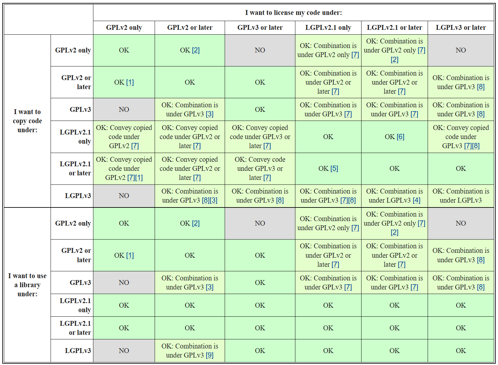
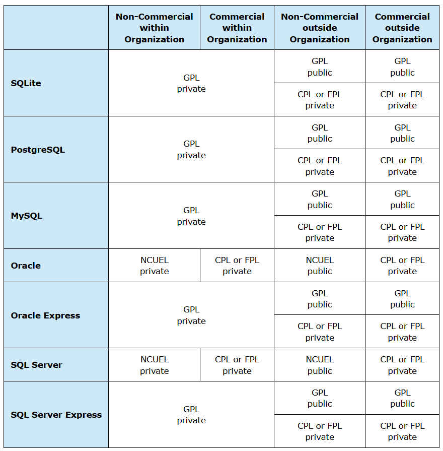

# ODB ORM license

The reasons for choosing ODB as the ORM system are described in the [document](./technologies.md).

We use several libraries in the project:
| Library          | License* (which we are now experiencing)                             |
| ---------------- | -------------------------------------------------------------------- |
| odb              | [GNU GPLv3 only**](https://www.codesynthesis.com/licenses/gpl-3.txt) |
| libodb           | [GNU GPLv2 only**](https://www.codesynthesis.com/licenses/gpl-2.txt) |
| libodb-pgsql     | [GNU GPLv2 only**](https://www.codesynthesis.com/licenses/gpl-2.txt) |

We comply with the specified licenses because:
1. The repository is public (open source)
2. We do not use this project for commercial purposes.

In addition to the licenses listed in the table, ODB offers other project licensing alternatives:
1. Commercial Proprietary License (CPL)
2. Free Proprietary License (FPL)

*License information is taken from the official [ODB repository](https://github.com/codesynthesis-com/odb/blob/master/LICENSE). 

**The `only` suffix imposes specific restrictions on the use of later versions of licenses. For example, in the case of `GNU GPLv2 only`, licensing a project that uses a library with a license of this type with the `GNU GPLv3` license is not allowed ([See the compatibility matrix below](#gnu-general-public-license-gpl-compatibility-matrix)).

## GNU General Public License (GPL) version 2 and GNU General Public License (GPL) version 3

ODB has a license in the following cases:
1. If the application is used only within the organization, for example, running it on company servers, then publication of the source code is not required. As ODB itself says, such an application is unlikely to become a source of significant earnings, so ODB can be used free of charge under the `GPL` license.

Quote:
```
If the application that is based on ODB is only used internally within the organization, then it is unlikely to be a source of significant revenue while its utility is most likely limited to this organization. As a result, in this case, ODB can be used under the GPL without giving anything back.

On the other hand, if you only use your application within your organization, such as running it on your company's servers, then you do not need to make your source code public.
```

2. If the application is used outside the organization, ODB can be used free of charge in accordance with the `GPL` license, but the source code of the application must be open.

Quote:
```
If the application that is based on ODB is distributed to third parties, then it is likely to be a source of revenue and/or to have broad utility. In this case the organization has two choices: It can use ODB free of charge under the GPL but has to make the source code for the entire application publicly available also free of charge (making the application essentially free).
```

If ODB has this license, then the project must also be licensed under the `GNU General Public License (GPL) version 2`, and the source code must be open, except for private internal use within the company.

### GNU General Public License (GPL) compatibility matrix

Below is a compatibility matrix for various GNU GPL licenses, which is available on the official website [gnu.org](https://www.gnu.org/licenses/gpl-faq.en.html#AllCompatibility).



Quote:
```
1: You must follow the terms of GPLv2 when incorporating the code in this case. You cannot take advantage of terms in later versions of the GPL.

2: While you may release under GPLv2-or-later both your original work, and/or modified versions of work you received under GPLv2-or-later, the GPLv2-only code that you're using must remain under GPLv2 only. As long as your project depends on that code, you won't be able to upgrade the license of your own code to GPLv3-or-later, and the work as a whole (any combination of both your project and the other code) can only be conveyed under the terms of GPLv2.

3: If you have the ability to release the project under GPLv2 or any later version, you can choose to release it under GPLv3 or any later version—and once you do that, you'll be able to incorporate the code released under GPLv3.

4: If you have the ability to release the project under LGPLv2.1 or any later version, you can choose to release it under LGPLv3 or any later version—and once you do that, you'll be able to incorporate the code released under LGPLv3.

5: You must follow the terms of LGPLv2.1 when incorporating the code in this case. You cannot take advantage of terms in later versions of the LGPL.

6: If you do this, as long as the project contains the code released under LGPLv2.1 only, you will not be able to upgrade the project's license to LGPLv3 or later.

7: LGPLv2.1 gives you permission to relicense the code under any version of the GPL since GPLv2. If you can switch the LGPLed code in this case to using an appropriate version of the GPL instead (as noted in the table), you can make this combination.

8: LGPLv3 is GPLv3 plus extra permissions that you can ignore in this case.

9: Because GPLv2 does not permit combinations with LGPLv3, you must convey the project under GPLv3's terms in this case, since it will allow that combination.
```

An important point is that the compiler license requirements do not apply to code generated by compilers. This means that even though we use the odb (ODB Compiler) library to generate database support code (*.cxx, *.hxx, and *.ixx.), which is licensed under `GPLv3 only`, the project is not subject to the requirements of the `GPLv3 only` license, on the condition that the source code of the library/library is not included in the project.

According to the information presented in the matrix, our project can have a `GPLv2 only` or `GPLv2 or later` license, since we use the `libodb` and `libodb-pgsql` libraries, both of which have `GPLv2 only` licenses.

## Special case: ODB Non-Commercial Use and Evaluation License (NCUEL)

Quote:
```
ODB can also be used free of charge non-commercially or for evaluation with non-free editions of commercial databases (Oracle, SQL Server) under the terms of the ODB Non-Commercial Use and Evaluation License (NCUEL) (a source-available license).
```

## Commercial Proprietary License (CPL)

If you do not want to be bound by the terms of the `GPL`, you can purchase a `Commercial Proprietary License (CPL)`.

This type of license allows the project to be used for commercial purposes, even in cases where the source code is closed.

Quote:
```
Additional benefits of the CPL include:
- Royalty-free runtime (no runtime licenses)
- Application source code stays private
- Legal assurances, warranties, and indemnification
- Commercial-grade technical support
- Full-time, dedicated development team provides ongoing maintenance, development, testing, and documentation
- Single vendor to hold accountable
```

## Free Proprietary License (FPL)

This is a free version of the Commercial Proprietary License (CPL). It allows you to use ODB in a closed application free of charge and without any GPL restrictions, provided that the amount of generated database support code in any individual release of the application does not exceed 10,000 lines that is approximately 10 models.

Quote:
```
In addition to the Commercial Proprietary License we offer a free version for handling small object models. This license allows you to use ODB in a proprietary (closed-source) application free of charge and without any of the GPL restrictions provided that the amount of the generated database support code in any single release of your application does not exceed 10,000 lines.
```

To start using ODB under `FPL`, you must obtain a copy of the license agreement.

### What is <u>generated database support code</u>??

The ODB Compiler analyzes classes and generates the necessary code for working with the database. Such files have the following extensions: *.cxx, *.hxx, and *.ixx.

Below is a table from the official website [codesynthesis.com](https://www.codesynthesis.com/products/odb/license.xhtml) that describes the project licensing rules when using ODB libraries.



## Conclusion

The project cannot be distributed under the `MIT` license while continuing to use ODB libraries because the `libodb` and `libodb-pgsql` libraries that we include in the project are distributed under the `GPLv2` license, which is not backward compatible with `MIT` license. In this case, the project must have a `GPLv2` license.

If it is necessary to close the source code of the project, we can do so while continuing to use the `GPLv2` license, provided that the project will be used within the company. Otherwise, we can use the `FPL` license, provided that the database support code does not exceed 10,000 lines for each individual project release, or we can purchase a `CPL` license.

## References

[Reference to GNU General Public License (GPL) version 2.](https://www.codesynthesis.com/licenses/gpl-2.txt)  
[Reference to GNU General Public License (GPL) version 3.](https://www.codesynthesis.com/licenses/gpl-3.txt)  
[Reference to the ODB Non-Commercial Use and Evaluation License (NCUEL).](https://www.codesynthesis.com/licenses/ncuel.txt)
[Licensing section on the Code Synthesis website.](https://www.codesynthesis.com/products/odb/license.xhtml#1)  
[Answers to questions about the GNU GPL v2 license, including an answer to a question about a closed-source project and the GNU GPL v2 license.](https://www.gnu.org/licenses/old-licenses/gpl-2.0-faq.en.html#GPLRequireSourcePostedPublic)  
[Report from the C++ Russia conference “Software licenses: theory that saves you from financial disaster”.](https://cppconf.ru/archive/2025/talks/06ea4864b2244143baefe7a725f12177/)
